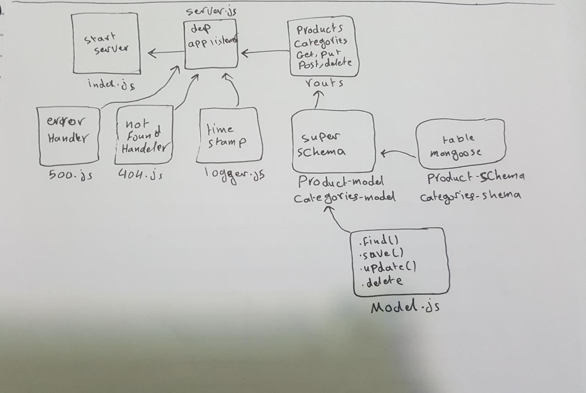

# api-server
# LAB - Class 07

## Project: api server

### Author: Anas Zain

### Links and Resources

- [submission PR](https://github.com/401-advanced-javascript-anas/api-server/pull/3)
- [Heroku]()

### Modules
#### `index.js`
### `404.js`
### `500.js`
### `server.js`
### `timestamp.js`
### `logger.js`

### Setup

#### How to initialize/run your application 

- `node index.js`

#### How to use your library 
#### Tests
- Lint test: `npm run lint`
- Code test: `npm run test`

#### UML

